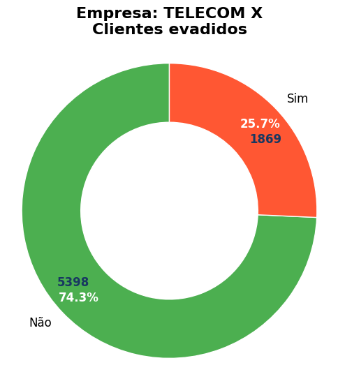

# Análise de Evasão de Clientes (Churn)

# TelecomX Brasil

## [](https://opensource.org/licenses/MIT)

Este repositório contém um notebook Jupyter (`TelecomX_BR.ipynb`) que realiza uma análise completa do problema de **evasão de clientes**, conhecido como **Churn**, na empresa do setor de telecomunicações. O objetivo principal é identificar os fatores que levam os clientes a cancelar seus serviços e propor estratégias de retenção baseadas em dados.


**Visão Geral do Projeto:**





## 🎯 Objetivo do Projeto

O propósito deste projeto é:

  * **Compreender o Churn:** Analisar as características e comportamentos dos clientes que evadem versus os que permanecem, revelando o "porquê" da evasão.
  * **Identificar Padrões:** Detectar padrões e correlações significativas entre as diversas variáveis do dataset (demográficas, de serviço, de contrato) e a ocorrência de Churn.
  * **Gerar Insights Acionáveis:** Fornecer conclusões claras e **recomendações práticas** para a equipe de negócios da TelecomX Brasil, permitindo a criação de estratégias proativas e direcionadas para a retenção de clientes.

## 📁 Estrutura do Projeto

O projeto é organizado de forma clara para facilitar a navegação e compreensão:

  * `TelecomX_BR.ipynb`: O coração deste projeto, este notebook contém todas as etapas da análise:
      * **Importação e Limpeza de Dados:** Detalha como os dados foram carregados, tratados e preparados para a análise.
      * **Análise Exploratória de Dados (EDA):** Apresenta visualizações e estatísticas descritivas para entender a distribuição das variáveis e suas relações com o Churn.
      * **Conclusões e Insights:** Sintetiza os principais achados da análise, destacando os fatores mais influentes no Churn.
      * **Recomendações Estratégicas:** Oferece sugestões concretas e baseadas em dados para mitigar a evasão de clientes.
  * `dados/`: Diretório que armazena o dataset utilizado (`TelecomX_Data.json`).
  * `assets/`: Diretório que armazena imagens usados no README.

## 🛠️ Tecnologias e Dependências

Para executar este notebook, você precisará das seguintes bibliotecas Python. Elas podem ser instaladas facilmente via `pip`:

```bash
pip install pandas numpy matplotlib seaborn
```

  * **pandas**: Indispensável para a manipulação e análise eficiente de estruturas de dados.
  * **numpy**: Essencial para operações numéricas e computação científica.
  * **matplotlib**: Biblioteca fundamental para a criação de gráficos e visualizações estáticas.
  * **seaborn**: Construída sobre o Matplotlib, oferece uma interface de alto nível para criar visualizações estatísticas atraentes e informativas.

## 🚀 Como Executar o Projeto

A maneira mais prática e recomendada para interagir com este projeto é através do **Google Colab**, que oferece um ambiente pronto com todas as dependências:

1.  **Clone o Repositório:**
    Abra seu terminal ou prompt de comando e execute:

    ```bash
    git clone https://github.com/lfa-systems/Telecom_X.git
    cd Telecom_X
    ```

2.  **Abra o Notebook no Google Colab:**

      * Acesse o Google Colab: [https://colab.research.google.com/](https://colab.research.google.com/)
      * No menu, clique em `File` (Arquivo) -\> `Open notebook` (Abrir notebook).
      * Vá para a aba `GitHub`.
      * Cole o link do seu repositório: `https://github.com/lfa-systems/Telecom_X/blob/main/TelecomX_BR.ipynb`
      * Selecione o arquivo `TelecomX_BR.ipynb` para abri-lo diretamente no ambiente do Colab.

3.  **Execute as Células:**
    Uma vez aberto no Colab, você pode executar cada célula do notebook sequencialmente ( usando `Shift + Enter` em cada celula ou o botão `Run all` (Executar tudo) no menu `Runtime` (Ambiente de execução) ). O notebook foi projetado para ser autossuficiente e guiará você por todas as etapas da análise. Certifique-se de que o arquivo de dados (`TelecomX_Data.json`) esteja no diretório `dados/` ou ajuste o caminho de carregamento no notebook.

## 📝 Relatório e Conclusões Detalhadas

O próprio notebook `TelecomX_BR.ipynb` serve como um relatório técnico e executivo, apresentando uma narrativa clara e visualizações que sustentam as conclusões. Ele aborda:

  * **Introdução:** O contexto do problema do Churn no setor de telecomunicações.
  * **Limpeza e Tratamento de Dados:** As etapas rigorosas para garantir a qualidade e consistência dos dados.
  * **Análise Exploratória de Dados (EDA):** Uma exploração visual e estatística das características dos clientes e sua relação com a evasão.
  * **Conclusões e Insights:** Os achados mais relevantes que explicam o comportamento de Churn.
  * **Recomendações:** Sugestões estratégicas e acionáveis para a retenção de clientes, baseadas nas evidências encontradas.

## 💡 Próximos Passos (Opcional)

Este projeto de análise exploratória pode ser expandido com:

  * **Modelagem Preditiva:** Desenvolvimento e avaliação de modelos de Machine Learning (e.g., Regressão Logística, Random Forest, XGBoost) para prever a probabilidade de Churn de clientes individuais.
  * **Engenharia de Features:** Criação de novas variáveis mais complexas a partir das existentes para melhorar o desempenho dos modelos preditivos.
  * **Testes A/B para Recomendações:** Planejamento e execução de experimentos controlados para validar a eficácia das estratégias de retenção propostas.

## 🤝 Contato

Se você tiver dúvidas, sugestões ou quiser discutir o projeto, sinta-se à vontade para entrar em contato:

  * **Nome:** Luciano Azevedo
  * **Email:** lucianocomputador@gmail.com
  * **LinkedIn:** [Perfil LinkedIn](https://www.linkedin.com/in/luciano-devops/)
  * **GitHub:** [Perfil GitHub](https://github.com/lfa-systems)

-----

## 📄 Licença

Este projeto está licenciado sob a licença **MIT License** - veja o arquivo [LICENSE](https://www.google.com/search?q=LICENSE) para detalhes.

-----